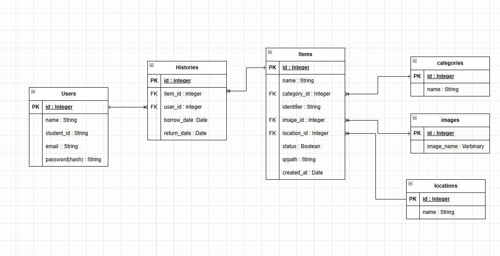

# tagdle（物品管理アプリ）

研究室内の備品や機材の貸出・返却状況を一元管理するためのWebアプリケーションです。  
QRコードによる簡易な操作と、履歴管理によって、利用状況を明確に把握できます。

---

## 目的

研究室で使用する機材・備品の **利用者・貸出状況を明確化** し、  
**紛失防止・重複利用の防止**・**返却漏れの防止** を支援する。

---

## 画面構成

- **新規登録 / ログイン**
- **ホーム画面（物品一覧）**
- **QRコード読み取り → 使用確認 / 返却 / エラー**
- **物品登録・削除**
- **物品詳細一覧**
- **履歴表示（今後追加予定）**

---

## ER図



主なエンティティ：

- `Users`: 利用者情報（名前・学籍番号・メール・パスワード）
- `Items`: 物品情報（分類・識別子・画像・保管場所・QRコード）
- `Histories`: 貸出・返却履歴
- `Categories`, `Images`, `Locations`: 各種補助情報

---

## 使用技術

| 種類 | 技術 |
|------|------|
| フロントエンド | Vite, React, TypeScript |
| バックエンド | FastAPI (Python) |
| データベース | MySQL |
| 認証 | JWT（JSON Web Token） |
| その他 | Docker, QRコード読取ライブラリ |

---

## セットアップ手順（Docker編）

```bash
# 1. リポジトリをクローン
git clone https://github.com/Izumo1120/tagdle.git
cd tagdle

# 2. .env ファイルの作成（例）
cp backend/.env.example backend/.env

# 3. Docker コンテナ起動
docker-compose up --build

# 4. 起動を確認する

http://localhost:{FRONTEND_PORT} でReactによるフロントエンドが起動
http://localhost:{BACKEND＿PORT} でFastAPIによるバックエンドが起動
```

---

## ディレクトリ構成

---

## JWT認証の流れ

このアプリでは、ログイン後に JWT（JSON Web Token）を利用してユーザー認証を行います。

### 認証フロー

1. **ユーザー登録 / ログイン**
   - クライアントがメールアドレス・パスワードを送信
   - バックエンド（FastAPI）が認証情報を検証
   - 正常であれば、JWTトークン（アクセストークン）を発行し、クライアントに返却

2. **トークンの保存**
   - クライアント側では、トークンを `localStorage` に保存

3. **保護されたAPIの呼び出し**
   - クライアントは API を呼び出す際、HTTPリクエストのヘッダーに以下を付与：

     ```
     Authorization: Bearer <JWTトークン>
     ```

4. **トークンの検証**
   - サーバー側ではトークンを検証し、正当な場合はリクエストを許可
   - 無効な場合は 401 Unauthorized を返却

---

## 制作メンバー

- **Githubアカウント名**: Izumo1120, k21rs021, keita2018, nodaiki, myamane0121
- **所属**: 佐賀大学 中山研究室
